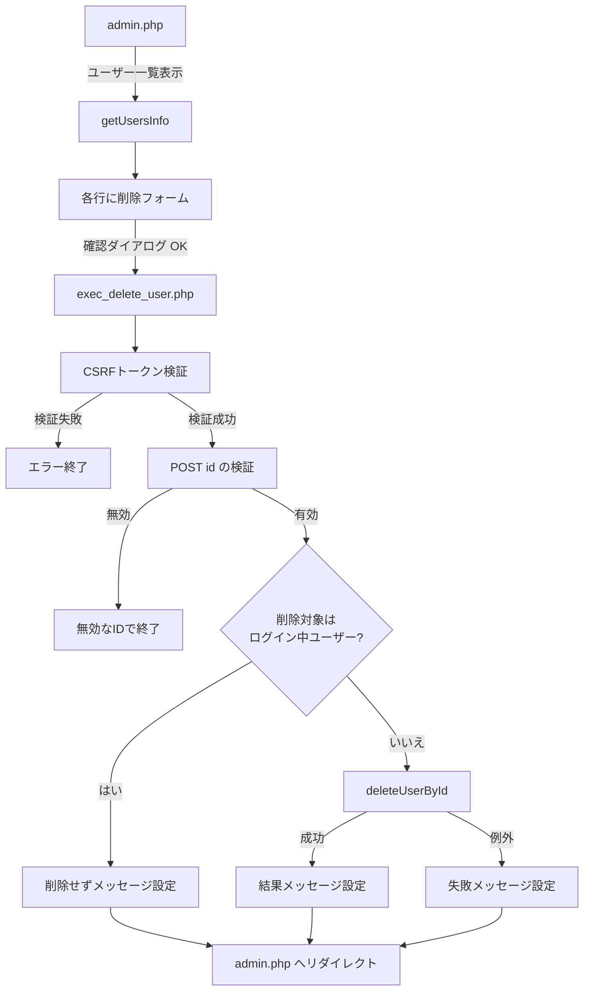

# 会員削除機能 仕様書

## 概要

管理者がログイン後、ユーザー一覧画面から指定した会員（ユーザー）レコードをデータベースから削除できる機能の実装仕様書です。本人によるアカウント退会（セルフ削除）は本仕様の対象外です（拡張案は [15. 拡張性](#15-拡張性) を参照）。

---

## 1. 全体像

### 処理フロー



### フローの詳細

1. **admin.php** → 全ユーザーを取得し、一覧テーブルを表示
2. **各行** → 削除用の POST フォーム（ユーザー ID・CSRF トークン）と送信前の JavaScript 確認ダイアログ
3. **exec_delete_user.php** → 以下の処理を実行
   - ログイン認証チェック
   - CSRF トークン検証・破棄
   - POST パラメータ `id` の整数検証
   - 削除対象がセッション上のログインユーザー自身でないことの確認
   - `users` テーブルから該当 ID の行を物理削除
   - 処理結果を `$_SESSION['msg']` に格納
4. **admin.php** → リダイレクト後、フラッシュメッセージを表示

---

## 2. データベース

### 対象テーブル

**users テーブル:**

| カラム名 | 型 | 説明 |
|---------|-----|------|
| id | INT | ユーザーID（主キー） |
| name | VARCHAR(255) | ユーザー名 |
| email | VARCHAR(255) | メールアドレス（UNIQUE） |
| password | VARCHAR(255) | パスワード（ハッシュ） |
| icon | VARCHAR(255) | アイコンファイル名（NULL 可） |
| created_at | TIMESTAMP | 登録日時 |

### 削除クエリ

```sql
DELETE FROM users WHERE id = :ID;
```

**備考:** 現行実装は**物理削除**です。削除後は当該ユーザーの行は存在しません。

---

## 3. 入力検証

### 3.1 削除対象 ID

**取得:** `filter_input(INPUT_POST, 'id', FILTER_VALIDATE_INT)`

| 項目 | 条件 | 挙動 |
|------|------|------|
| 整数として解釈可能 | `FILTER_VALIDATE_INT` が偽でない | 削除処理へ進む |
| 不正・未送信 | 上記が偽 | `exit('無効なIDです')` で終了 |

---

## 4. セキュリティ

### 4.1 ログイン認証

**関数:** `requireLogin('./login.php')`

**処理:**

- セッションにログイン情報がない場合、ログイン画面へリダイレクト

### 4.2 CSRF トークン

**生成:** `generateCsrfToken()`（一覧画面表示時）

**検証:** `verifyCsrfToken(string $token): bool`

**破棄:** `destroyCsrfToken()`

**処理フロー:**

1. 一覧表示時にトークンを生成してセッションに保存し、フォームの hidden に埋め込む
2. 削除 POST 時にトークンを検証
3. 検証後、トークンを破棄

**検証失敗時:**

- `exit('不正なリクエストです')`

### 4.3 ログイン中ユーザーの自己削除禁止

**処理:**

```php
if (isset($_SESSION['user']['id']) && $user_id === (int)$_SESSION['user']['id']) {
  $_SESSION['msg'] = 'ログイン中のユーザー情報は削除できません';
  redirect('./admin.php');
}
```

**目的:** 誤操作や不正リクエストにより、操作中の管理者セッションが参照するユーザーが消え、不整合やロックアウトになることを防ぐ。

---

## 5. DB 操作

### 5.1 ユーザー削除（ID 指定）

**関数:** `deleteUserById(int $id): int`

**ファイル:** `src/functions/db.php`

**戻り値:** 削除された行数（`PDOStatement::rowCount()`）。対象 ID が存在しなければ `0`。

**例外:**

- `PDOException` — 接続・実行エラー時（呼び出し側で捕捉しメッセージ表示）

---

## 6. エラーハンドリング

### 6.1 フラッシュメッセージ

一覧画面は `getMessage()` でメッセージを取得し、表示後にセッションから削除する（`src/functions/session-message.php`）。

### 6.2 メッセージ一覧

| ケース | メッセージ / 挙動 | リダイレクト先 |
|--------|-------------------|----------------|
| CSRF 不正 | `exit('不正なリクエストです')` | なし |
| ID 不正 | `exit('無効なIDです')` | なし |
| ログイン中ユーザーを削除しようとした | 「ログイン中のユーザー情報は削除できません」 | `admin.php` |
| 削除成功（1 行以上） | 「ユーザーを削除しました」 | `admin.php` |
| 対象ユーザーなし（0 行） | 「ユーザーが見つかりませんでした」 | `admin.php` |
| `PDOException` | 「削除に失敗しました」 | `admin.php` |

---

## 7. セッション管理

### 7.1 結果通知

**設定:**

```php
$_SESSION['msg'] = '...';
```

**タイミング:** 削除処理の分岐ごとに設定し、`redirect('./admin.php')` 前に行う。

### 7.2 メッセージの消費

**関数:** `getMessage()`

一覧表示時に一度だけ表示され、`getMessage()` 内でセッションの `msg` はクリアされる。

---

## 8. 画面（テンプレート）

### 8.1 ユーザー一覧・削除 UI

**ファイル:** `src/template/admin_template.php`

**表示要素:**

- ユーザー一覧テーブル（メールアドレス、ユーザー名、ユーザー ID）
- 各行末尾の「削除」ボタン（`POST` → `exec_delete_user.php`）
- hidden: `csrf_token`, `id`（対象ユーザーの ID）
- 送信前の `confirm()`（ユーザー名を含む文言）

**フォーム例:**

```html
<form action="./exec_delete_user.php" method="post" onsubmit="return confirm('...を削除しますか？')">
  <input type="hidden" name="csrf_token" value="<?= $csrf_token ?>">
  <input type="hidden" name="id" value="<?= $user['id'] ?>">
  <button type="submit" class="btn btn-outline-danger btn-sm">削除</button>
</form>
```

---

## 9. 処理実行（エンドポイント）

### 9.1 一覧表示

**ファイル:** `public/admin/admin.php`

**処理:**

1. ログイン認証チェック
2. `getUsersInfo()` でユーザー一覧取得
3. `getMessage()` でフラッシュメッセージ取得（あれば表示用に一度だけ消費）
4. CSRF トークン生成
5. テンプレート読み込み

### 9.2 削除実行

**ファイル:** `public/admin/exec_delete_user.php`

**処理フロー:**

1. ログイン認証チェック
2. CSRF トークン検証 → 失敗時は終了
3. CSRF トークン破棄
4. POST `id` を整数検証 → 失敗時は終了
5. ログイン中ユーザー自身でないことを確認 → 該当時はメッセージ付きリダイレクト
6. `deleteUserById()` 実行（try / catch で `PDOException` を捕捉）
7. 行数に応じてメッセージ設定
8. `admin.php` へリダイレクト

---

## 10. 関連ファイル一覧

```
login/
├── public/
│   └── admin/
│       ├── admin.php              # ユーザー一覧・削除フォーム表示
│       └── exec_delete_user.php   # 削除処理
├── src/
│   ├── functions/
│   │   ├── db.php                 # deleteUserById()
│   │   ├── csrf.php               # CSRF 生成・検証・破棄
│   │   ├── session-message.php    # getMessage() など
│   │   └── redirect.php           # redirect()
│   └── template/
│       └── admin_template.php     # 一覧・削除 UI
```

---

## 11. テストケース

### 11.1 正常系

| テストケース | 前提 | 期待結果 |
|-------------|------|----------|
| 他ユーザーを削除 | ログイン中の ID と異なる `id` を POST | 該当行が DELETE され、「ユーザーを削除しました」 |
| 存在しない ID | 既に削除済みまたは未使用の ID | 行数 0、「ユーザーが見つかりませんでした」 |

### 11.2 異常系・制約

| テストケース | 条件 | 期待結果 |
|-------------|------|----------|
| 未ログイン | セッションなし | ログイン画面へ |
| CSRF 不正 | トークン欠如・不一致 | `不正なリクエストです` で終了 |
| ID 不正 | 非整数・未送信 | `無効なIDです` で終了 |
| 自己削除 | POST `id` = ログイン中ユーザー ID | 削除されず「ログイン中のユーザー情報は削除できません」 |
| DB エラー | DB 切断など | 「削除に失敗しました」 |

---

## 12. セキュリティ考慮事項

- **ログイン認証必須** — 未認証からの削除 POST を拒否
- **CSRF トークン** — 第三者サイトからの意図しない削除 POST を抑止
- **プリペアドステートメント** — SQL インジェクション対策（`deleteUserById`）
- **整数バリデーション** — 不正な `id` パラメータの拒否
- **自己削除禁止** — 操作中アカウントの誤削除防止
- **確認ダイアログ** — 誤クリックの軽減（ブラウザ側。必須の最終防衛ではない）

---

## 13. データ・運用上の注意

| 項目 | 現状 |
|------|------|
| 削除方式 | 物理削除（復元なし） |
| 関連データ | `users` のみ削除。アイコン画像ファイルの明示的な削除処理は本機能に含まれない |
| 管理者権限の区別 | 「管理者ロール」と「一般ユーザー」の区別は DB 上なく、ログイン済みユーザーは一覧から任意の他ユーザーを削除可能（設計上の前提を運用で補うか、将来ロールを導入するかは別検討） |

---

## 14. UI/UX 考慮事項

### 14.1 確認ダイアログ

- 送信前に `confirm()` でユーザー名を含め、削除の不可逆性を認識させる

### 14.2 フィードバック

- 成功・失敗・抑止（自己削除）・見つからない、いずれも `admin.php` でアラート表示し、操作結果が分かるようにする

### 14.3 一覧の最新化

- 削除後は `admin.php` へ戻るため、一覧は再取得され最新状態になる

---

## 15. 拡張性

### 15.1 将来的な拡張案

- **本人による退会（アカウント削除）** — `account-edit` 配下に専用画面・実行スクリプトを追加し、パスワード再確認やメール確認後に削除または無効化
- **ソフトデリート** — `deleted_at` カラムで論理削除し、復元・監査に対応
- **ロールベース制御** — 削除可能なユーザーを管理者のみに限定
- **最終管理者の保護** — 管理者が 1 人だけのときの削除禁止など
- **監査ログ** — 誰がいつどのユーザーを削除したかを記録
- **関連リソースの整理** — アイコンファイルの削除、アップロード領域の整合性

### 15.2 拡張時の考慮事項

- 論理削除に変える場合は `deleteUserById` の代わりに `UPDATE`、ログイン・一覧クエリに「有効ユーザーのみ」の条件が必要
- 本人退会時は削除成功後にセッション破棄とログアウト画面への誘導が必要

---

**作成日:** 2026-03-23

**バージョン:** 1.0
