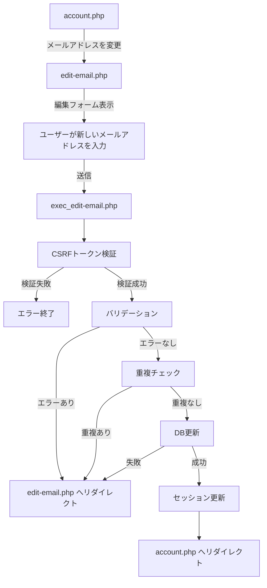

# メールアドレス編集機能 仕様書

## 概要

ユーザーがログイン中のメールアドレスを変更できる機能の実装仕様書です。

---

## 1. 全体像

### 処理フロー



### フローの詳細

1. **account.php** → 「メールアドレスを変更」リンクを表示
2. **edit-email.php** → メールアドレス編集フォームを表示
3. **ユーザーが入力** → 新しいメールアドレスを入力して送信
4. **exec_edit-email.php** → 以下の処理を実行
   - CSRFトークン検証
   - バリデーション（形式チェック、長さチェック）
   - 重複チェック（既に登録されているメールアドレスかどうか）
   - DB更新（`users` テーブルの `email` カラム）
   - セッション情報の更新
5. **account.php** → 変更完了後、アカウント情報画面へリダイレクト

---

## 2. データベース

### 対象テーブル

**users テーブル:**

| カラム名 | 型 | 説明 |
|---------|-----|------|
| id | INT | ユーザーID（主キー） |
| email | VARCHAR(255) | メールアドレス（一意） |
| name | VARCHAR(255) | ユーザー名 |
| password | VARCHAR(255) | パスワード（ハッシュ化） |

### 更新クエリ

```sql
UPDATE users
SET email = :new_email
WHERE id = :user_id;
```

---

## 3. バリデーション

### 3.1 入力値のトリミング

**関数:** `getTrimmedPostValue('email')`

**処理:**
- POST値から前後の空白を削除

### 3.2 メールアドレスバリデーション

**関数:** `getMailValidationErrors(string $email): array`
**ファイル:** `src/functions/validation-error.php`

**バリデーション項目:**

| 項目 | 条件 | エラーメッセージ |
|------|------|------------------|
| 必須チェック | 空文字の場合 | 「メールアドレスを入力してください。」 |
| 形式チェック | メール形式でない場合 | 「メールアドレスの形式が正しくありません。」 |
| 長さチェック | 320文字を超える場合 | 「メールアドレスは320文字以内で入力してください。」 |

**使用する汎用関数:**
- `isEmpty(string $value): bool` - 空文字チェック
- `isEmailFormat(string $email): bool` - メール形式チェック
- `isWithinLength(string $value, ?int $min, ?int $max): bool` - 長さチェック

### 3.3 重複チェック

**関数:** `getUserRegister(string $email): array`
**ファイル:** `src/functions/db.php`

**処理:**
- DBから同じメールアドレスが存在するかチェック
- 既に登録されている場合はエラー

**エラーメッセージ:**
- 「そのメールアドレスはすでに使用されています。」

---

## 4. セキュリティ

### 4.1 ログイン認証

**関数:** `requireLogin('../login.php')`

**処理:**
- セッションにログイン情報がない場合、ログイン画面へリダイレクト

### 4.2 CSRFトークン

**生成:** `generateCsrfToken()`
**検証:** `verifyCsrfToken(string $token): bool`
**破棄:** `destroyCsrfToken()`

**処理フロー:**
1. フォーム表示時にトークンを生成してセッションに保存
2. フォーム送信時にトークンを検証
3. 検証後、トークンを破棄

**検証失敗時:**
- `exit('不正なリクエストです')`

---

## 5. DB操作

### 5.1 ユーザー情報更新

**関数:** `updateUser(int $user_id, string $field, string $value): bool`
**ファイル:** `src/functions/db.php`

**パラメータ:**
- `$user_id`: ユーザーID（セッションから取得）
- `$field`: 更新するカラム名（`'email'`）
- `$value`: 新しい値

**例外:**
- `InvalidArgumentException` - 不正なフィールド名
- `PDOException` - データベースエラー

---

## 6. エラーハンドリング

### 6.1 エラー時のリダイレクト

**関数:** `redirectWithErrors(array $errors, array $old_input, string $redirect_url)`

**処理:**
1. エラーメッセージを `$_SESSION['errors']` に保存
2. 入力値を `$_SESSION['old_input']` に保存
3. 指定URLへリダイレクト

### 6.2 エラーの種類

| エラーケース | エラーメッセージ | リダイレクト先 |
|-------------|------------------|---------------|
| バリデーションエラー | バリデーション関数が返すメッセージ | `edit-email.php` |
| 重複エラー | 「そのメールアドレスはすでに使用されています。」 | `edit-email.php` |
| システムエラー | 「システムエラーが発生しました」 | `edit-email.php` |
| DBエラー | 「データベースエラーが発生しました」 | `edit-email.php` |

---

## 7. セッション管理

### 7.1 セッションの更新

**更新対象:**
```php
$_SESSION['user']['email'] = $new_email;
```

**タイミング:**
- DB更新成功後

### 7.2 エラー情報のクリア

**処理:**
```php
unset($_SESSION['errors']);
unset($_SESSION['old_input']);
```

**タイミング:**
- フォーム表示時（一度表示したらクリア）

---

## 8. 画面（テンプレート）

### 8.1 編集フォーム画面

**ファイル:** `src/template/edit-email_template.php`

**表示項目:**
- ナビゲーションバー
- サイドバーメニュー
- メールアドレス入力フォーム
- CSRFトークン（hidden input）
- エラーメッセージ表示エリア
- 送信ボタン
- キャンセルボタン

**フォーム要素:**
```html
<form method="POST" action="exec_edit-email.php">
  <input type="hidden" name="csrf_token" value="<?= $csrf_token ?>">
  <input type="email" name="email" value="<?= $old_input['email'] ?? '' ?>">
  <button type="submit">変更する</button>
</form>
```

---

## 9. 処理実行（エンドポイント）

### 9.1 編集画面表示

**ファイル:** `public/account-edit/edit-email.php`

**処理:**
1. ログイン認証チェック
2. CSRFトークン生成
3. セッションからエラーと入力値を取得
4. セッションをクリア
5. テンプレート読み込み

### 9.2 更新処理

**ファイル:** `public/account-edit/exec_edit-email.php`

**処理フロー:**
1. ログイン認証チェック
2. CSRFトークン検証 → 失敗時は終了
3. CSRFトークン破棄
4. 入力値のトリミング
5. バリデーション → エラー時はリダイレクト
6. 重複チェック → 重複時はリダイレクト
7. DB更新 → 失敗時はリダイレクト
8. セッション更新
9. `account.php` へリダイレクト

---

## 10. 関連ファイル一覧

```
login/
├── public/
│   ├── account-edit/
│   │   ├── edit-email.php              # 編集画面表示
│   │   └── exec_edit-email.php         # 更新処理
│   └── admin/
│       └── account.php                 # アカウント情報画面（遷移元・遷移先）
├── src/
│   ├── functions/
│   │   ├── validation.php              # 汎用バリデーション関数
│   │   ├── validation-error.php        # メールアドレス用バリデーション
│   │   └── db.php                      # DB操作関数
│   └── template/
│       └── edit-email_template.php     # 編集画面テンプレート
```

---

## 11. テストケース

### 11.1 正常系

| テストケース | 入力値 | 期待結果 |
|-------------|--------|---------|
| 正常なメールアドレス | `test@example.com` | 更新成功、account.php へリダイレクト |
| 長いメールアドレス | 320文字以内の正常なメールアドレス | 更新成功 |

### 11.2 異常系

| テストケース | 入力値 | 期待結果 |
|-------------|--------|---------|
| 空文字 | `` | 「メールアドレスを入力してください。」 |
| 不正な形式 | `test@` | 「メールアドレスの形式が正しくありません。」 |
| 長すぎる | 321文字以上 | 「メールアドレスは320文字以内で入力してください。」 |
| 重複 | 既存のメールアドレス | 「そのメールアドレスはすでに使用されています。」 |
| CSRFトークン不正 | 不正なトークン | 「不正なリクエストです」で終了 |

---

## 12. セキュリティ考慮事項

- **ログイン認証必須** - 未認証ユーザーはアクセス不可
- **CSRFトークン** - CSRF攻撃対策
- **プリペアドステートメント** - SQLインジェクション対策
- **XSS対策** - 出力時にエスケープ処理（`escape()` 関数）
- **重複チェック** - 既存ユーザーとの競合を防止
- **エラーメッセージ** - 詳細な情報を漏らさない

---

**作成日:** 2026-03-22
**バージョン:** 1.0
