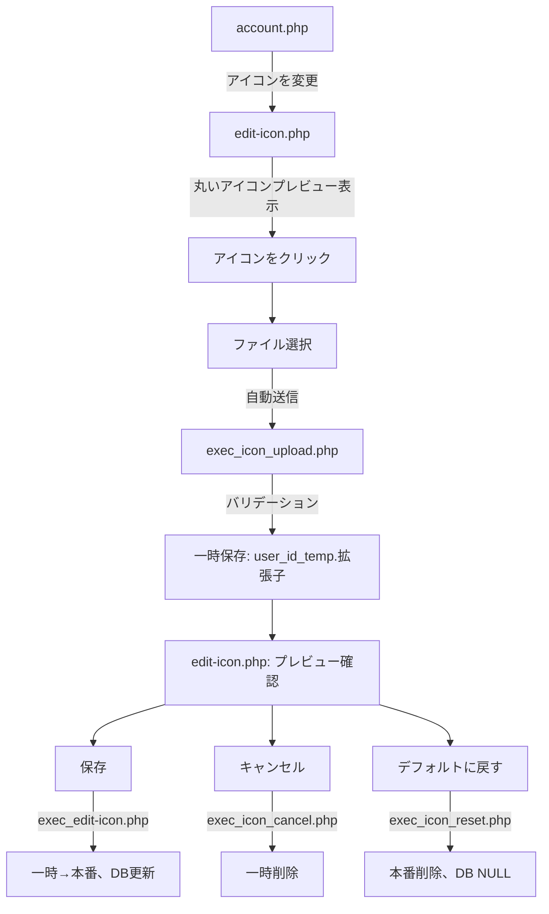

# アイコン編集機能 仕様書

## 概要

ユーザーがプロフィールアイコンを変更・管理できる機能の実装仕様書です。

---

## 1. 全体像

### 処理フロー



### フローの詳細

1. **account.php** → 「アイコンを変更」リンクを表示
2. **edit-icon.php** → 丸いアイコンプレビューを表示
3. **アイコンをクリック** → ファイル選択ダイアログを開く
4. **選択後** → 自動送信 → `exec_icon_upload.php` へ
5. **バリデーション** → 一時保存（`{user_id}_temp.拡張子`）→ `edit-icon.php` へリダイレクト
6. **プレビュー確認** → 以下3つのボタンから選択
   - **A. 保存** → `exec_edit-icon.php` → 一時ファイルを本番ファイルに移動 → DB更新
   - **B. キャンセル** → `exec_icon_cancel.php` → 一時ファイル削除
   - **C. デフォルトに戻す** → `exec_icon_reset.php` → 本番ファイル削除、DB を NULL に設定

---

## 2. 準備

### 2.1 データベース

**users テーブルにカラム追加:**

```sql
ALTER TABLE users ADD COLUMN icon VARCHAR(255) NULL;
```

- `icon`: アイコンファイル名を格納（例: `123_icon.png`）
- `NULL` の場合はデフォルトアイコンを使用

### 2.2 ディレクトリと画像

**必要なディレクトリとファイル:**

1. `public/image/icon/` ディレクトリを作成
2. `public/image/icon/default.png` を配置（デフォルトアイコン画像）

---

## 3. 基礎的な関数（ファイル・DB操作）

### 3.1 アイコンファイル操作

**ファイル:** `src/functions/icon-file.php`

**役割:**
- アイコンファイルの保存
- アイコンファイルの削除
- アイコンファイルパスの取得
- 一時ファイルと本番ファイルの管理

### 3.2 DB操作

**ファイル:** `src/functions/db.php`

**役割:**
- アイコンカラムの更新
- アイコンカラムの取得
- DB接続とクエリ実行

---

## 4. バリデーション

### 4.1 汎用的な画像バリデーション

**ファイル:** `src/functions/validation.php`

**役割:**
- 画像ファイルの形式チェック
- ファイルサイズチェック
- MIME タイプチェック
- その他汎用的なバリデーション処理

### 4.2 アイコン専用バリデーション

**ファイル:** `src/functions/validation-error.php`

**役割:**
- アイコン特有のバリデーションルール
- エラーメッセージの生成
- バリデーション結果の返却

---

## 5. アイコン管理・表示

### 5.1 アイコン管理

**ファイル:** `src/functions/icon.php`

**役割:**
- アイコンの保存処理
- アイコンの削除処理
- アイコンの更新処理
- 一時ファイルから本番ファイルへの移行

### 5.2 アイコン表示

**ファイル:** `src/functions/display_icon.php`

**役割:**
- アイコンの表示ロジック
- デフォルトアイコンの判定
- アイコンパスの生成
- HTML出力処理

---

## 6. 画面（テンプレート）

### 6.1 アイコン編集画面

**ファイル:** `src/template/edit-icon_template.php`

**役割:**
- アイコン編集専用画面のテンプレート
- プレビュー表示
- 3つのボタン（保存、キャンセル、デフォルトに戻す）の配置
- ファイル選択UIの実装

### 6.2 アカウント画面（既存に追記）

**ファイル:** `src/template/account_template.php`

**役割:**
- アカウント情報画面にアイコン項目を追加
- 「アイコンを変更」リンクの追加

---

## 7. 処理実行（エンドポイント）

### 7.1 編集画面表示

**ファイル:** `public/account-edit/edit-icon.php`

**役割:**
- アイコン編集画面の表示
- 現在のアイコン情報の取得
- テンプレートのレンダリング

### 7.2 一時保存

**ファイル:** `public/account-edit/exec_icon_upload.php`

**役割:**
- アップロードファイルの受信
- バリデーション実行
- 一時ファイルとして保存（`{user_id}_temp.拡張子`）
- `edit-icon.php` へリダイレクト

### 7.3 確定（保存）

**ファイル:** `public/account-edit/exec_edit-icon.php`

**役割:**
- 一時ファイルを本番ファイルに移動
- DBのiconカラムを更新
- 完了画面へリダイレクト

### 7.4 キャンセル

**ファイル:** `public/account-edit/exec_icon_cancel.php`

**役割:**
- 一時ファイルの削除
- アカウント画面へリダイレクト

### 7.5 リセット（デフォルトに戻す）

**ファイル:** `public/account-edit/exec_icon_reset.php`

**役割:**
- 本番ファイルの削除
- DBのiconカラムをNULLに設定
- デフォルトアイコンに戻す

---

## 8. ファイル命名規則

| ファイル種別 | 命名パターン | 例 |
|------------|------------|-----|
| 一時ファイル | `{user_id}_temp.{拡張子}` | `123_temp.png` |
| 本番ファイル | `{user_id}_icon.{拡張子}` | `123_icon.jpg` |
| デフォルト | `default.png` | `default.png` |

---

## 9. セキュリティ考慮事項

- ファイルアップロード時のバリデーション必須
- MIMEタイプの検証
- ファイルサイズの制限
- 不正な拡張子の拒否
- セッション管理によるユーザー認証
- CSRFトークンの実装（推奨）

---

## 10. 実装順序

1. **STEP 2**: DB設定、ディレクトリ準備
2. **STEP 3**: 基礎関数の実装
3. **STEP 4**: バリデーション機能の実装
4. **STEP 5**: アイコン管理・表示機能の実装
5. **STEP 6**: 画面テンプレートの作成
6. **STEP 7**: 処理実行エンドポイントの実装
7. **テスト**: 各フローの動作確認

---

## 付録

### A. 関連ファイル一覧

```
login/
├── public/
│   ├── account-edit/
│   │   ├── edit-icon.php              # 編集画面
│   │   ├── exec_icon_upload.php       # 一時保存
│   │   ├── exec_edit-icon.php         # 確定
│   │   ├── exec_icon_cancel.php       # キャンセル
│   │   └── exec_icon_reset.php        # リセット
│   └── image/
│       └── icon/
│           └── default.png            # デフォルトアイコン
├── src/
│   ├── functions/
│   │   ├── icon-file.php              # ファイル操作
│   │   ├── db.php                     # DB操作
│   │   ├── validation.php             # 汎用バリデーション
│   │   ├── validation-error.php       # アイコン用バリデーション
│   │   ├── icon.php                   # アイコン管理
│   │   └── display_icon.php           # アイコン表示
│   └── template/
│       ├── edit-icon_template.php     # 編集画面テンプレート
│       └── account_template.php       # アカウント画面（追記）
```

---

**作成日:** 2026-03-22
**バージョン:** 1.0
