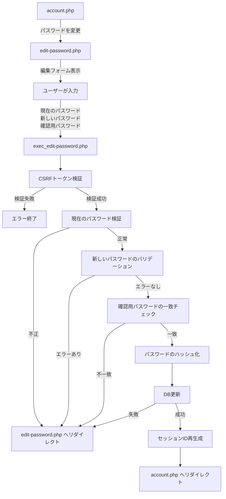

# パスワード編集機能 仕様書

## 概要

ユーザーがログイン中のパスワードを安全に変更できる機能の実装仕様書です。

---

## 1. 全体像

### 処理フロー



### フローの詳細

1. **account.php** → 「パスワードを変更」リンクを表示
2. **edit-password.php** → パスワード編集フォームを表示
3. **ユーザーが入力** → 以下の3つの項目を入力
   - 現在のパスワード
   - 新しいパスワード
   - 新しいパスワード（確認用）
4. **exec_edit-password.php** → 以下の処理を実行
   - CSRFトークン検証
   - 現在のパスワードの検証（DBと照合）
   - 新しいパスワードのバリデーション
   - 確認用パスワードの一致チェック
   - パスワードのハッシュ化
   - DB更新（`users` テーブルの `password` カラム）
   - セッションIDの再生成（セキュリティ対策）
5. **account.php** → 変更完了後、アカウント情報画面へリダイレクト

---

## 2. データベース

### 対象テーブル

**users テーブル:**

| カラム名 | 型 | 説明 |
|---------|-----|------|
| id | INT | ユーザーID（主キー） |
| email | VARCHAR(255) | メールアドレス |
| name | VARCHAR(255) | ユーザー名 |
| password | VARCHAR(255) | パスワード（ハッシュ化） |

### 更新クエリ

```sql
UPDATE users
SET password = :password_hash
WHERE id = :user_id;
```

---

## 3. バリデーション

### 3.1 現在のパスワード検証

**関数:** `getCurrentPasswordErrors(string $current_password, int $user_id): array`
**ファイル:** `src/functions/validation-error.php`

**バリデーション項目:**

| 項目 | 条件 | エラーメッセージ |
|------|------|------------------|
| 必須チェック | 空文字の場合 | 「現在のパスワードを入力してください。」 |
| 一致チェック | DBのパスワードと不一致 | 「現在のパスワードが正しくありません。」 |

**使用する関数:**
- `isEmpty(string $value): bool` - 空文字チェック
- `isCurrentPasswordCorrect(string $password, int $user_id): bool` - パスワード一致チェック（`password_verify()` を使用）

### 3.2 新しいパスワードのバリデーション

**関数:** `getPasswordValidationErrors(string $password): array`
**ファイル:** `src/functions/validation-error.php`

**バリデーション項目:**

| 項目 | 条件 | エラーメッセージ |
|------|------|------------------|
| 必須チェック | 空文字の場合 | 「パスワードを入力してください。」 |
| 形式チェック | 半角英数字と記号以外を含む | 「パスワードは半角英数字と記号で入力してください。」 |
| 長さチェック | 16文字未満、または64文字超過 | 「パスワードは16文字以上64文字以内で入力してください。」 |

**使用する汎用関数:**
- `isEmpty(string $value): bool` - 空文字チェック
- `isPasswordFormat(string $password): bool` - パスワード形式チェック
- `isWithinLength(string $value, ?int $min, ?int $max): bool` - 長さチェック

### 3.3 確認用パスワードの一致チェック

**関数:** `getPasswordCheck(string $password, string $password_check): array`
**ファイル:** `src/functions/validation-error.php`

**バリデーション項目:**

| 項目 | 条件 | エラーメッセージ |
|------|------|------------------|
| 必須チェック | 空文字の場合 | 「パスワード（確認用）を入力してください。」 |
| 一致チェック | 新しいパスワードと不一致 | 「パスワードが一致していません」 |

---

## 4. セキュリティ

### 4.1 ログイン認証

**関数:** `requireLogin('../login.php')`

**処理:**
- セッションにログイン情報がない場合、ログイン画面へリダイレクト

### 4.2 CSRFトークン

**生成:** `generateCsrfToken()`
**検証:** `verifyCsrfToken(string $token): bool`
**破棄:** `destroyCsrfToken()`

**処理フロー:**
1. フォーム表示時にトークンを生成してセッションに保存
2. フォーム送信時にトークンを検証
3. 検証後、トークンを破棄

**検証失敗時:**
- `exit('不正なリクエストです')`

### 4.3 パスワードのハッシュ化

**使用関数:** `password_hash(string $password, int $algo)`

**アルゴリズム:** `PASSWORD_DEFAULT`（現在は bcrypt）

**例:**
```php
$password_hash = password_hash($new_password, PASSWORD_DEFAULT);
```

### 4.4 セッションID再生成

**関数:** `session_regenerate_id(true)`

**タイミング:**
- パスワード変更成功後

**目的:**
- セッション固定攻撃対策
- パスワード変更という重要な操作の後にセッションIDを更新

---

## 5. DB操作

### 5.1 ユーザー情報更新

**関数:** `updateUser(int $user_id, string $field, string $value): bool`
**ファイル:** `src/functions/db.php`

**パラメータ:**
- `$user_id`: ユーザーID（セッションから取得）
- `$field`: 更新するカラム名（`'password'`）
- `$value`: ハッシュ化されたパスワード

**例外:**
- `InvalidArgumentException` - 不正なフィールド名
- `PDOException` - データベースエラー

---

## 6. エラーハンドリング

### 6.1 エラー時のリダイレクト

**関数:** `redirectWithErrors(array $errors, array $old_input, string $redirect_url)`

**処理:**
1. エラーメッセージを `$_SESSION['errors']` に保存
2. 指定URLへリダイレクト

**注意点:**
- パスワードは `$old_input` に保存しない（セキュリティのため）

### 6.2 エラーの種類

**エラー構造:**
```php
$errors = [
    'current_password' => ['現在のパスワードが正しくありません。'],
    'new_password' => ['パスワードは16文字以上64文字以内で入力してください。'],
    'new_password_confirm' => ['パスワードが一致していません']
];
```

| エラーケース | エラーフィールド | リダイレクト先 |
|-------------|----------------|---------------|
| 現在のパスワード不正 | `current_password` | `edit-password.php` |
| 新しいパスワード不正 | `new_password` | `edit-password.php` |
| 確認用パスワード不一致 | `new_password_confirm` | `edit-password.php` |
| システムエラー | `errors` | `edit-password.php` |
| DBエラー | `errors` | `edit-password.php` |

---

## 7. セッション管理

### 7.1 セッションIDの再生成

**処理:**
```php
session_regenerate_id(true);
```

**パラメータ:**
- `true` - 古いセッションファイルを削除

**タイミング:**
- DB更新成功後

### 7.2 エラー情報のクリア

**処理:**
```php
unset($_SESSION['errors'], $_SESSION['old_input']);
```

**タイミング:**
- フォーム表示時（一度表示したらクリア）

---

## 8. 画面（テンプレート）

### 8.1 編集フォーム画面

**ファイル:** `src/template/edit-password_template.php`

**表示項目:**
- ナビゲーションバー
- サイドバーメニュー
- パスワード入力フォーム（3つのフィールド）
- CSRFトークン（hidden input）
- エラーメッセージ表示エリア（フィールドごと）
- 送信ボタン
- キャンセルボタン

**フォーム要素:**
```html
<form method="POST" action="exec_edit-password.php">
  <input type="hidden" name="csrf_token" value="<?= $csrf_token ?>">

  <!-- 現在のパスワード -->
  <input type="password" name="current_password">
  <?php if (!empty($errors['current_password'])): ?>
    <span><?= $errors['current_password'][0] ?></span>
  <?php endif; ?>

  <!-- 新しいパスワード -->
  <input type="password" name="new_password">
  <?php if (!empty($errors['new_password'])): ?>
    <span><?= $errors['new_password'][0] ?></span>
  <?php endif; ?>

  <!-- 新しいパスワード（確認用） -->
  <input type="password" name="new_password_confirm">
  <?php if (!empty($errors['new_password_confirm'])): ?>
    <span><?= $errors['new_password_confirm'][0] ?></span>
  <?php endif; ?>

  <button type="submit">変更する</button>
</form>
```

---

## 9. 処理実行（エンドポイント）

### 9.1 編集画面表示

**ファイル:** `public/account-edit/edit-password.php`

**処理:**
1. ログイン認証チェック
2. CSRFトークン生成
3. セッションからエラーを取得
4. セッションをクリア
5. テンプレート読み込み

### 9.2 更新処理

**ファイル:** `public/account-edit/exec_edit-password.php`

**処理フロー:**
1. ログイン認証チェック
2. CSRFトークン検証 → 失敗時は終了
3. CSRFトークン破棄
4. POST値を取得
5. バリデーション（3つのフィールドを個別に検証）
6. エラーチェック → エラー時はリダイレクト
7. パスワードのハッシュ化
8. DB更新 → 失敗時はリダイレクト
9. セッションID再生成
10. `account.php` へリダイレクト

---

## 10. 関連ファイル一覧

```
login/
├── public/
│   ├── account-edit/
│   │   ├── edit-password.php           # 編集画面表示
│   │   └── exec_edit-password.php      # 更新処理
│   └── admin/
│       └── account.php                 # アカウント情報画面（遷移元・遷移先）
├── src/
│   ├── functions/
│   │   ├── validation.php              # 汎用バリデーション関数
│   │   ├── validation-error.php        # パスワード用バリデーション
│   │   └── db.php                      # DB操作関数
│   └── template/
│       └── edit-password_template.php  # 編集画面テンプレート
```

---

## 11. テストケース

### 11.1 正常系

| テストケース | 現在のPW | 新しいPW | 確認用PW | 期待結果 |
|-------------|---------|---------|---------|---------|
| 正常なパスワード変更 | `correct_password` | `new_password_1234567` | `new_password_1234567` | 更新成功、account.php へリダイレクト |
| 最小文字数 | `correct_password` | `1234567890123456` | `1234567890123456` | 更新成功 |
| 最大文字数 | `correct_password` | 64文字のパスワード | 64文字のパスワード | 更新成功 |

### 11.2 異常系

| テストケース | 現在のPW | 新しいPW | 確認用PW | 期待結果 |
|-------------|---------|---------|---------|---------|
| 現在のPW空欄 | `` | `new_password_1234567` | `new_password_1234567` | 「現在のパスワードを入力してください。」 |
| 現在のPW不正 | `wrong_password` | `new_password_1234567` | `new_password_1234567` | 「現在のパスワードが正しくありません。」 |
| 新しいPW空欄 | `correct_password` | `` | `` | 「パスワードを入力してください。」 |
| 新しいPW短い | `correct_password` | `short` | `short` | 「パスワードは16文字以上64文字以内で入力してください。」 |
| 新しいPW長い | `correct_password` | 65文字以上 | 65文字以上 | 「パスワードは16文字以上64文字以内で入力してください。」 |
| 不正な形式 | `correct_password` | `全角パスワード` | `全角パスワード` | 「パスワードは半角英数字と記号で入力してください。」 |
| 確認用PW不一致 | `correct_password` | `password123456789` | `password987654321` | 「パスワードが一致していません」 |
| 確認用PW空欄 | `correct_password` | `password123456789` | `` | 「パスワード（確認用）を入力してください。」 |
| CSRFトークン不正 | - | - | - | 「不正なリクエストです」で終了 |

---

## 12. セキュリティ考慮事項

- **ログイン認証必須** - 未認証ユーザーはアクセス不可
- **CSRFトークン** - CSRF攻撃対策
- **現在のパスワード検証** - 第三者による不正な変更を防止
- **パスワードのハッシュ化** - `password_hash()` で bcrypt を使用
- **セッションID再生成** - セッション固定攻撃対策
- **プリペアドステートメント** - SQLインジェクション対策
- **パスワードを再表示しない** - セキュリティのため入力値を保持しない
- **強力なパスワードポリシー** - 16文字以上64文字以内、半角英数字と記号
- **エラーメッセージ** - 詳細な情報を漏らさない

---

## 13. パスワードポリシー

| 項目 | ルール |
|------|--------|
| 最小文字数 | 16文字 |
| 最大文字数 | 64文字 |
| 使用可能文字 | 半角英数字と記号 |
| 使用不可文字 | 全角文字、制御文字 |
| ハッシュアルゴリズム | bcrypt（`PASSWORD_DEFAULT`） |

---

**作成日:** 2026-03-22
**バージョン:** 1.0
