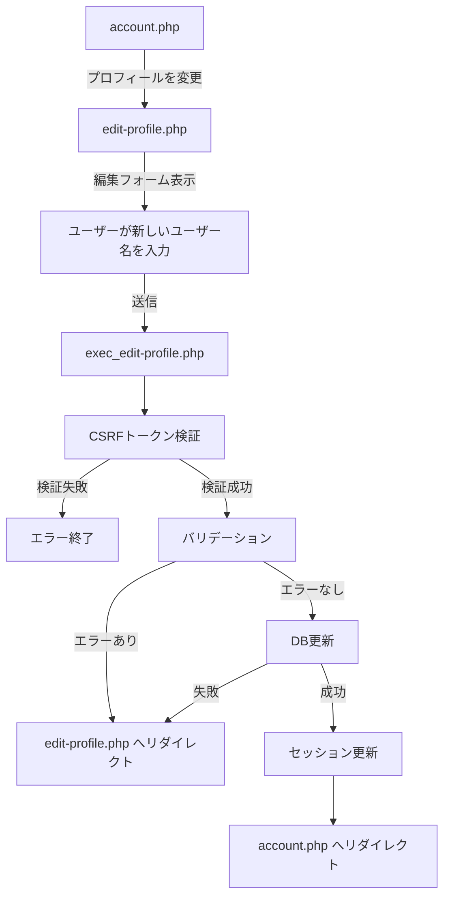

# プロフィール（ユーザー名）編集機能 仕様書

## 概要

ユーザーがログイン中のプロフィール情報（ユーザー名）を変更できる機能の実装仕様書です。

---

## 1. 全体像

### 処理フロー



### フローの詳細

1. **account.php** → 「プロフィールを変更」リンクを表示
2. **edit-profile.php** → ユーザー名編集フォームを表示
3. **ユーザーが入力** → 新しいユーザー名を入力して送信
4. **exec_edit-profile.php** → 以下の処理を実行
   - CSRFトークン検証
   - バリデーション（空白チェック、形式チェック、長さチェック）
   - DB更新（`users` テーブルの `name` カラム）
   - セッション情報の更新
5. **account.php** → 変更完了後、アカウント情報画面へリダイレクト

---

## 2. データベース

### 対象テーブル

**users テーブル:**

| カラム名 | 型 | 説明 |
|---------|-----|------|
| id | INT | ユーザーID（主キー） |
| email | VARCHAR(255) | メールアドレス |
| name | VARCHAR(255) | ユーザー名 |
| password | VARCHAR(255) | パスワード（ハッシュ化） |

### 更新クエリ

```sql
UPDATE users
SET name = :new_name
WHERE id = :user_id;
```

---

## 3. バリデーション

### 3.1 入力値のトリミング

**関数:** `getTrimmedPostValue('name')`

**処理:**
- POST値から前後の空白を削除

### 3.2 ユーザー名バリデーション

**関数:** `getUserNameValidationErrors(string $name): array`
**ファイル:** `src/functions/validation-error.php`

**バリデーション項目:**

| 項目 | 条件 | エラーメッセージ |
|------|------|------------------|
| 必須チェック | 空文字の場合 | 「ユーザー名を入力してください。」 |
| 形式チェック | 使用できない文字を含む | 「使用できない文字が含まれています。」 |
| 長さチェック | 3文字未満、または16文字超過 | 「ユーザー名は3文字以上16文字以内で入力してください。」 |

**使用する汎用関数:**
- `isEmpty(string $value): bool` - 空文字チェック
- `isUserNameFormat(string $name): bool` - ユーザー名形式チェック
- `isWithinLength(string $value, ?int $min, ?int $max): bool` - 長さチェック

### 3.3 使用可能文字の定義

**許可される文字:**
- 半角英数字（a-z, A-Z, 0-9）
- アンダースコア（_）
- ハイフン（-）
- 日本語（ひらがな、カタカナ、漢字）

**使用不可の文字:**
- 記号（一部を除く）
- 制御文字
- 絵文字

---

## 4. セキュリティ

### 4.1 ログイン認証

**関数:** `requireLogin('../login.php')`

**処理:**
- セッションにログイン情報がない場合、ログイン画面へリダイレクト

### 4.2 CSRFトークン

**生成:** `generateCsrfToken()`
**検証:** `verifyCsrfToken(string $token): bool`
**破棄:** `destroyCsrfToken()`

**処理フロー:**
1. フォーム表示時にトークンを生成してセッションに保存
2. フォーム送信時にトークンを検証
3. 検証後、トークンを破棄

**検証失敗時:**
- `exit('不正なリクエストです')`

---

## 5. DB操作

### 5.1 ユーザー情報更新

**関数:** `updateUser(int $user_id, string $field, string $value): bool`
**ファイル:** `src/functions/db.php`

**パラメータ:**
- `$user_id`: ユーザーID（セッションから取得）
- `$field`: 更新するカラム名（`'name'`）
- `$value`: 新しい値

**例外:**
- `InvalidArgumentException` - 不正なフィールド名
- `PDOException` - データベースエラー

---

## 6. エラーハンドリング

### 6.1 エラー時のリダイレクト

**関数:** `redirectWithErrors(array $errors, array $old_input, string $redirect_url)`

**処理:**
1. エラーメッセージを `$_SESSION['errors']` に保存
2. 入力値を `$_SESSION['old_input']` に保存
3. 指定URLへリダイレクト

### 6.2 エラーの種類

| エラーケース | エラーメッセージ | リダイレクト先 |
|-------------|------------------|---------------|
| バリデーションエラー | バリデーション関数が返すメッセージ | `edit-profile.php` |
| システムエラー | 「システムエラーが発生しました」 | `edit-profile.php` |
| DBエラー | 「データベースエラーが発生しました」 | `edit-profile.php` |

---

## 7. セッション管理

### 7.1 セッションの更新

**更新対象:**
```php
$_SESSION['user']['name'] = $new_name;
```

**タイミング:**
- DB更新成功後

**重要性:**
- セッションを更新しないと、画面上の表示名が古いままになる
- ナビゲーションバーなどに表示されるユーザー名を即座に反映

### 7.2 エラー情報のクリア

**処理:**
```php
unset($_SESSION['errors'], $_SESSION['old_input']);
```

**タイミング:**
- フォーム表示時（一度表示したらクリア）

---

## 8. 画面（テンプレート）

### 8.1 編集フォーム画面

**ファイル:** `src/template/edit-profile_template.php`

**表示項目:**
- ナビゲーションバー
- サイドバーメニュー
- ユーザー名入力フォーム
- CSRFトークン（hidden input）
- エラーメッセージ表示エリア
- 送信ボタン
- キャンセルボタン

**フォーム要素:**
```html
<form method="POST" action="exec_edit-profile.php">
  <input type="hidden" name="csrf_token" value="<?= $csrf_token ?>">
  <input type="text" name="name" value="<?= $old_input['name'] ?? '' ?>" maxlength="16">
  <button type="submit">変更する</button>
</form>
```

---

## 9. 処理実行（エンドポイント）

### 9.1 編集画面表示

**ファイル:** `public/account-edit/edit-profile.php`

**処理:**
1. ログイン認証チェック
2. CSRFトークン生成
3. セッションからエラーと入力値を取得
4. セッションをクリア
5. テンプレート読み込み

### 9.2 更新処理

**ファイル:** `public/account-edit/exec_edit-profile.php`

**処理フロー:**
1. ログイン認証チェック
2. CSRFトークン検証 → 失敗時は終了
3. CSRFトークン破棄
4. 入力値のトリミング
5. バリデーション → エラー時はリダイレクト
6. DB更新 → 失敗時はリダイレクト
7. セッション更新
8. `account.php` へリダイレクト

---

## 10. 関連ファイル一覧

```
login/
├── public/
│   ├── account-edit/
│   │   ├── edit-profile.php            # 編集画面表示
│   │   └── exec_edit-profile.php       # 更新処理
│   └── admin/
│       └── account.php                 # アカウント情報画面（遷移元・遷移先）
├── src/
│   ├── functions/
│   │   ├── validation.php              # 汎用バリデーション関数
│   │   ├── validation-error.php        # ユーザー名用バリデーション
│   │   └── db.php                      # DB操作関数
│   └── template/
│       └── edit-profile_template.php   # 編集画面テンプレート
```

---

## 11. テストケース

### 11.1 正常系

| テストケース | 入力値 | 期待結果 |
|-------------|--------|---------|
| 正常なユーザー名（英数字） | `user123` | 更新成功、account.php へリダイレクト |
| 正常なユーザー名（日本語） | `太郎` | 更新成功 |
| 正常なユーザー名（混在） | `ユーザー123` | 更新成功 |
| 最小文字数 | `abc` | 更新成功 |
| 最大文字数 | `1234567890123456` | 更新成功 |
| アンダースコア使用 | `user_name` | 更新成功 |
| ハイフン使用 | `user-name` | 更新成功 |

### 11.2 異常系

| テストケース | 入力値 | 期待結果 |
|-------------|--------|---------|
| 空文字 | `` | 「ユーザー名を入力してください。」 |
| 空白のみ | `   ` | 「ユーザー名を入力してください。」（トリミング後） |
| 短すぎる | `ab` | 「ユーザー名は3文字以上16文字以内で入力してください。」 |
| 長すぎる | `12345678901234567` | 「ユーザー名は3文字以上16文字以内で入力してください。」 |
| 使用不可文字（記号） | `user@name` | 「使用できない文字が含まれています。」 |
| 使用不可文字（絵文字） | `user😊` | 「使用できない文字が含まれています。」 |
| 使用不可文字（制御文字） | `user\nname` | 「使用できない文字が含まれています。」 |
| CSRFトークン不正 | - | 「不正なリクエストです」で終了 |

---

## 12. セキュリティ考慮事項

- **ログイン認証必須** - 未認証ユーザーはアクセス不可
- **CSRFトークン** - CSRF攻撃対策
- **プリペアドステートメント** - SQLインジェクション対策
- **XSS対策** - 出力時にエスケープ処理（`escape()` 関数）
- **入力値のトリミング** - 前後の空白を削除して処理
- **文字種制限** - 不正な文字をバリデーションで排除
- **文字数制限** - 3〜16文字の範囲内に制限

---

## 13. ユーザー名ポリシー

| 項目 | ルール |
|------|--------|
| 最小文字数 | 3文字 |
| 最大文字数 | 16文字 |
| 使用可能文字 | 半角英数字、アンダースコア、ハイフン、日本語（ひらがな・カタカナ・漢字） |
| 使用不可文字 | 制御文字、特殊記号（一部を除く）、絵文字 |
| 空白の扱い | 前後の空白は自動削除（トリミング） |
| 重複チェック | なし（同じユーザー名の登録可） |

---

## 14. UI/UX考慮事項

### 14.1 入力値の保持

- バリデーションエラー時は入力値を保持
- ユーザーが再入力する手間を省く

### 14.2 エラー表示

- エラーメッセージはフォームの上部または入力欄の近くに表示
- 具体的なエラー内容を明示

### 14.3 リアルタイムフィードバック（推奨）

- JavaScript での文字数カウント表示
- 入力中のリアルタイムバリデーション

### 14.4 現在の値の表示

- フォーム表示時に現在のユーザー名を表示
- プレースホルダーまたは初期値として設定

---

## 15. 拡張性

### 15.1 将来的な拡張案

- **自己紹介文の追加** - `bio` カラムを追加
- **プロフィール画像の変更** - アイコン機能との統合
- **SNSリンクの追加** - Twitter, GitHub などのリンク
- **公開設定** - プロフィールの公開/非公開設定
- **ユーザー名の重複チェック** - ユニークなユーザー名の導入

### 15.2 拡張時の考慮事項

- `updateUser()` 関数は汎用的なので、他のフィールドにも対応可能
- テンプレートファイルに項目を追加するだけで拡張できる設計

---

**作成日:** 2026-03-22
**バージョン:** 1.0
