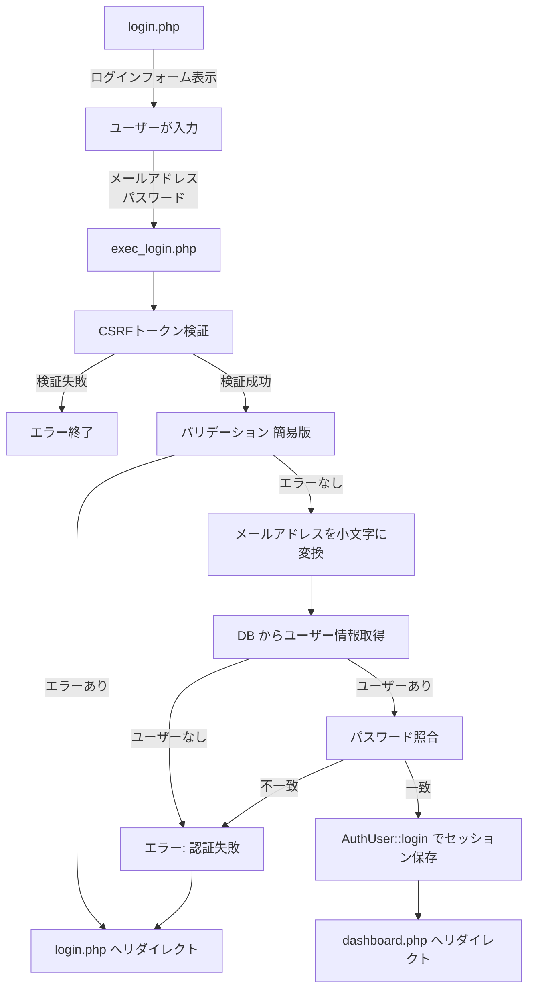

# ログイン機能 仕様書

## 概要

ユーザーがメールアドレスとパスワードを使用してシステムにログインする機能の実装仕様書です。

---

## 1. 全体像

### 処理フロー



### フローの詳細

1. **login.php** → ログインフォームを表示
2. **ユーザーが入力** → メールアドレスとパスワードを入力
3. **exec_login.php** → 以下の処理を実行
   - CSRFトークン検証
   - バリデーション（簡易版：空欄チェック、形式チェック、長さチェック）
   - メールアドレスを小文字に変換（大文字小文字の区別をなくす）
   - DBからユーザー情報を取得
   - パスワード照合（`password_verify()` でハッシュと照合）
   - 認証成功時：`AuthUser::login()` でセッションにユーザー情報を保存
   - 認証失敗時：エラーメッセージを表示してログインページへ戻る
4. **dashboard.php** → ログイン成功後、ダッシュボード画面へリダイレクト

---

## 2. データベース

### 対象テーブル

**users テーブル:**

| カラム名 | 型 | 説明 |
|---------|-----|------|
| id | INT | ユーザーID（主キー） |
| email | VARCHAR(255) | メールアドレス（一意） |
| name | VARCHAR(255) | ユーザー名 |
| password | VARCHAR(255) | パスワード（ハッシュ化） |

### 取得クエリ

```sql
SELECT id, email, password, name
FROM users
WHERE email = :EMAIL
LIMIT 1;
```

---

## 3. バリデーション

### 3.1 入力値の取得

**メールアドレス:**
- `getTrimmedPostValue('email')` - 前後の空白を削除

**パスワード:**
- `$_POST['password'] ?? ''` - トリミングなし

### 3.2 簡易バリデーション

ログイン時は**簡易版**のバリデーションを使用します（詳細版は会員登録で使用）。

#### メールアドレスバリデーション

**関数:** `getSimpleEmailErrors(string $email): array`
**ファイル:** `src/functions/validation-error.php`

**バリデーション項目:**

| 項目 | 条件 | エラーメッセージ |
|------|------|------------------|
| 必須チェック | 空文字の場合 | 「メールアドレスを入力してください。」 |
| 形式チェック | メール形式でない場合 | 「メールアドレスの形式が正しくありません。」 |
| 長さチェック | 320文字を超える場合 | 「メールアドレスは320文字以内で入力してください。」 |

**使用する汎用関数:**
- `isEmpty(string $value): bool` - 空文字チェック
- `isEmailFormat(string $email): bool` - メール形式チェック
- `isWithinLength(string $value, ?int $min, ?int $max): bool` - 長さチェック

#### パスワードバリデーション

**関数:** `getSimplePasswordErrors(string $password): array`
**ファイル:** `src/functions/validation-error.php`

**バリデーション項目:**

| 項目 | 条件 | エラーメッセージ |
|------|------|------------------|
| 必須チェック | 空文字の場合 | 「パスワードを入力してください。」 |
| 形式チェック | 半角英数字と記号以外を含む | 「パスワードの形式が正しくありません。」 |
| 長さチェック | 16文字未満、または64文字超過 | 「パスワードは16文字以上64文字以内で入力してください。」 |

**使用する汎用関数:**
- `isEmpty(string $value): bool` - 空文字チェック
- `isPasswordFormat(string $password): bool` - パスワード形式チェック
- `isWithinLength(string $value, ?int $min, ?int $max): bool` - 長さチェック

### 3.3 メールアドレスの正規化

**処理:**
```php
$email = mb_strtolower($email, 'UTF-8');
```

**目的:**
- メールアドレスは大文字小文字を区別しない
- `test@example.com` と `Test@Example.com` を同一視
- 統一して小文字で保存・照合

---

## 4. 認証処理

### 4.1 ユーザー情報の取得

**関数:** `getUserLogin(string $login): array`
**ファイル:** `src/functions/db.php`

**処理:**
- メールアドレスに一致するユーザーをDBから取得
- `LIMIT 1` で1件のみ取得

**戻り値:**
```php
[
    [
        'id' => 1,
        'email' => 'test@example.com',
        'name' => 'テストユーザー',
        'password' => '$2y$10$...' // ハッシュ化されたパスワード
    ]
]
```

### 4.2 パスワード照合

**関数:** `password_verify(string $password, string $hash): bool`

**処理:**
```php
if (count($user_info) && password_verify($password, $user_info[0]['password'])) {
    // 認証成功
} else {
    // 認証失敗
}
```

**チェック項目:**
1. ユーザー情報が存在するか（`count($user_info) > 0`）
2. パスワードが一致するか（`password_verify()`）

### 4.3 ログイン処理

**クラス:** `AuthUser`
**ファイル:** `src/Auth/AuthUser.php`

**メソッド:** `AuthUser::login(array $user): void`

**処理:**
```php
AuthUser::login([
    'id'    => $user_info[0]['id'],
    'name'  => $user_info[0]['name'],
    'email' => $user_info[0]['email'],
]);
```

**内部処理:**
```php
$_SESSION['user'] = $user;
```

**セッションに保存される情報:**
- `id`: ユーザーID
- `name`: ユーザー名
- `email`: メールアドレス

---

## 5. セキュリティ

### 5.1 CSRFトークン

**生成:** `generateCsrfToken()`
**検証:** `verifyCsrfToken(string $token): bool`
**破棄:** `destroyCsrfToken()`

**処理フロー:**
1. フォーム表示時にトークンを生成してセッションに保存
2. フォーム送信時にトークンを検証
3. 検証後、トークンを破棄

**検証失敗時:**
- `exit('不正なリクエストです')`

### 5.2 パスワードのハッシュ化

**使用関数:**
- 保存時: `password_hash(string $password, int $algo)` - bcrypt でハッシュ化
- 照合時: `password_verify(string $password, string $hash)` - ハッシュと照合

**セキュリティ対策:**
- 平文パスワードをDBに保存しない
- bcrypt による強力なハッシュ化
- ソルト自動生成

### 5.3 エラーメッセージ

**認証失敗時のメッセージ:**
```php
$_SESSION['error_message'] = 'メールアドレスまたはパスワードが正しくありません。';
```

**セキュリティ考慮:**
- 「メールアドレスが存在しない」「パスワードが間違っている」を区別しない
- どちらのエラーか特定されないようにする（ユーザー列挙攻撃対策）

### 5.4 SQLインジェクション対策

**プリペアドステートメント使用:**
```php
$stmt = $pdo->prepare($sql);
$stmt->bindValue(':EMAIL', $email, PDO::PARAM_STR);
$stmt->execute();
```

---

## 6. エラーハンドリング

### 6.1 エラーの種類

**エラー構造:**
```php
$errors = [
    'email' => ['メールアドレスを入力してください。'],
    'password' => ['パスワードを入力してください。']
];
```

| エラーケース | エラーメッセージ | セッション変数 | リダイレクト先 |
|-------------|------------------|---------------|---------------|
| バリデーションエラー | 各フィールドのエラー | `$_SESSION['errors']` | `login.php` |
| 認証失敗 | 「メールアドレスまたはパスワードが正しくありません。」 | `$_SESSION['error_message']` | `login.php` |
| DBエラー | 「データベースエラーが発生しました」 | `$_SESSION['error_message']` | `login.php` |

### 6.2 エラー時のリダイレクト

**関数:** `redirect(string $url)`

**処理:**
1. エラーメッセージをセッションに保存
2. 指定URLへリダイレクト
3. フォーム画面でエラー表示
4. 表示後、セッションからクリア

---

## 7. セッション管理

### 7.1 ログイン状態の確認

**メソッド:** `AuthUser::isLogin(): bool`

**処理:**
```php
return isset($_SESSION['user']);
```

### 7.2 ログインユーザー情報の取得

**メソッド:** `AuthUser::getUser(): ?array`

**戻り値:**
```php
[
    'id' => 1,
    'name' => 'テストユーザー',
    'email' => 'test@example.com'
]
```

### 7.3 ログイン必須チェック

**メソッド:** `AuthUser::requireLogin(string $loginPath = './login.php'): void`

**処理:**
- 未ログインの場合、ログインページへリダイレクト
- 保護されたページの先頭で呼び出す

**使用例:**
```php
AuthUser::requireLogin('../login.php');
```

---

## 8. 画面（テンプレート）

### 8.1 ログインフォーム画面

**ファイル:** `src/template/login_template.php`

**表示項目:**
- ページタイトル「ログイン」
- 成功メッセージ表示エリア（会員登録後など）
- エラーメッセージ表示エリア（認証失敗時）
- メールアドレス入力フィールド
- パスワード入力フィールド
- CSRFトークン（hidden input）
- ログインボタン
- 会員登録リンク

**フォーム要素:**
```html
<form action="./exec_login.php" method="post">
  <!-- メールアドレス -->
  <input type="email"
         name="email"
         class="<?= !empty($errors['email']) ? 'is-invalid' : '' ?>"
         value="<?= isset($email) ? escape($email) : '' ?>">

  <!-- エラー表示 -->
  <?php if (!empty($errors['email'])): ?>
    <div class="invalid-feedback">
      <?php foreach ($errors['email'] as $error): ?>
        <div><?= escape($error) ?></div>
      <?php endforeach; ?>
    </div>
  <?php endif; ?>

  <!-- パスワード -->
  <input type="password" name="password">

  <!-- CSRFトークン -->
  <input type="hidden" name="csrf_token" value="<?= $csrf_token ?>">

  <button type="submit">ログイン</button>
</form>
```

---

## 9. 処理実行（エンドポイント）

### 9.1 ログイン画面表示

**ファイル:** `public/login.php`

**処理:**
1. メッセージ取得（会員登録完了メッセージなど）
2. セッションからエラーメッセージ取得
3. セッションをクリア
4. CSRFトークン生成
5. テンプレート読み込み

### 9.2 ログイン処理

**ファイル:** `public/exec_login.php`

**処理フロー:**
1. CSRFトークン検証 → 失敗時は終了
2. CSRFトークン破棄
3. 入力値の取得（メールアドレスはトリミング）
4. バリデーション → エラー時はリダイレクト
5. メールアドレスを小文字に変換
6. DBからユーザー情報取得
7. パスワード照合 → 失敗時はリダイレクト
8. `AuthUser::login()` でセッションに保存
9. `dashboard.php` へリダイレクト

---

## 10. 関連ファイル一覧

```
login/
├── public/
│   ├── login.php                       # ログイン画面表示
│   ├── exec_login.php                  # ログイン処理
│   └── admin/
│       └── dashboard.php               # ログイン後の画面
├── src/
│   ├── Auth/
│   │   └── AuthUser.php                # 認証ユーザークラス
│   ├── functions/
│   │   ├── validation.php              # 汎用バリデーション関数
│   │   ├── validation-error.php        # 簡易バリデーション
│   │   └── db.php                      # DB操作関数
│   └── template/
│       └── login_template.php          # ログイン画面テンプレート
```

---

## 11. テストケース

### 11.1 正常系

| テストケース | メールアドレス | パスワード | 期待結果 |
|-------------|---------------|-----------|---------|
| 正常ログイン | `test@example.com` | 正しいパスワード | dashboard.php へリダイレクト |
| 大文字メール | `Test@Example.com` | 正しいパスワード | 小文字変換後、ログイン成功 |

### 11.2 異常系

| テストケース | メールアドレス | パスワード | 期待結果 |
|-------------|---------------|-----------|---------|
| メール空欄 | `` | `password` | 「メールアドレスを入力してください。」 |
| メール形式不正 | `test@` | `password` | 「メールアドレスの形式が正しくありません。」 |
| パスワード空欄 | `test@example.com` | `` | 「パスワードを入力してください。」 |
| 存在しないメール | `notexist@example.com` | `password` | 「メールアドレスまたはパスワードが正しくありません。」 |
| パスワード不一致 | `test@example.com` | `wrongpassword` | 「メールアドレスまたはパスワードが正しくありません。」 |
| CSRFトークン不正 | - | - | 「不正なリクエストです」で終了 |

---

## 12. セキュリティ考慮事項

### 12.1 基本的なセキュリティ対策

- **CSRFトークン** - CSRF攻撃対策
- **パスワードハッシュ化** - bcrypt でハッシュ化、`password_verify()` で照合
- **プリペアドステートメント** - SQLインジェクション対策
- **XSS対策** - 出力時にエスケープ処理（`escape()` 関数）

### 12.2 認証関連のセキュリティ

- **エラーメッセージの統一** - ユーザー列挙攻撃対策
- **メールアドレスの正規化** - 大文字小文字の統一
- **簡易バリデーション** - 必要最小限のチェック（詳細は会員登録で実施）

### 12.3 推奨される追加対策

以下は現在未実装だが、セキュリティ強化のために推奨される対策：

- **ログイン試行回数制限** - ブルートフォース攻撃対策
- **アカウントロック機能** - 連続失敗時の一時ロック
- **IPアドレスログ** - 不正アクセスの追跡
- **2段階認証** - SMS、TOTPなど
- **セッションタイムアウト** - 一定時間後の自動ログアウト
- **Remember Me 機能** - 次回自動ログイン

---

## 13. AuthUser クラスの機能

### 13.1 主要メソッド

| メソッド | 説明 | 戻り値 |
|---------|------|--------|
| `isLogin()` | ログイン状態を確認 | `bool` |
| `getUser()` | ログインユーザー情報を取得 | `?array` |
| `login(array $user)` | ログイン処理 | `void` |
| `logout()` | ログアウト処理 | `void` |
| `requireLogin(string $path)` | ログイン必須チェック | `void` |
| `getUserId()` | ログインユーザーIDを取得 | `?int` |
| `getEmail()` | ログインユーザーメールを取得 | `?string` |
| `getName()` | ログインユーザー名を取得 | `?string` |
| `isAdmin()` | 管理者かどうかを確認 | `bool` |

### 13.2 使用例

```php
// ログイン状態確認
if (AuthUser::isLogin()) {
    echo "ログイン済み";
}

// ログインユーザー情報取得
$user = AuthUser::getUser();
echo $user['name'];

// ログイン必須チェック（未ログインならリダイレクト）
AuthUser::requireLogin('../login.php');

// ログアウト
AuthUser::logout();
```

---

## 14. ログインとログアウトのフロー

### 14.1 ログインフロー

```
1. login.php でフォーム表示
2. ユーザーが入力
3. exec_login.php で処理
4. AuthUser::login() でセッション保存
5. dashboard.php へリダイレクト
```

### 14.2 ログアウトフロー

```
1. logout.php などでログアウト処理
2. AuthUser::logout() でセッションから削除
3. login.php へリダイレクト
```

---

**作成日:** 2026-03-22
**バージョン:** 1.0
