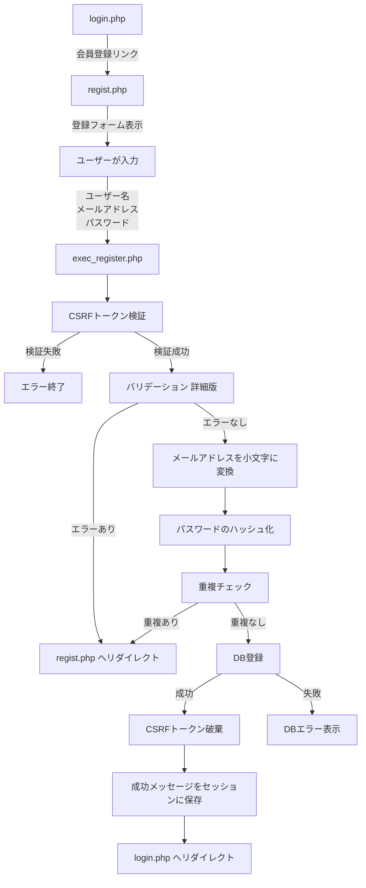

# 会員登録機能 仕様書

## 概要

新規ユーザーがアカウントを作成するための会員登録機能の実装仕様書です。

---

## 1. 全体像

### 処理フロー



### フローの詳細

1. **login.php** → 「会員登録はこちら」リンクを表示
2. **regist.php** → 会員登録フォームを表示
3. **ユーザーが入力** → 以下の3つの項目を入力
   - ユーザー名
   - メールアドレス
   - パスワード
4. **exec_register.php** → 以下の処理を実行
   - CSRFトークン検証
   - バリデーション（詳細版：空欄チェック、形式チェック、長さチェック）
   - メールアドレスを小文字に変換
   - パスワードのハッシュ化
   - 重複チェック（既に登録されているメールアドレスかどうか）
   - DB登録（`users` テーブルに新規ユーザー追加）
   - 成功メッセージをセッションに保存
5. **login.php** → 登録完了メッセージを表示し、ログインを促す

---

## 2. データベース

### 対象テーブル

**users テーブル:**

| カラム名 | 型 | 説明 |
|---------|-----|------|
| id | INT | ユーザーID（主キー、自動採番） |
| email | VARCHAR(255) | メールアドレス（一意） |
| name | VARCHAR(255) | ユーザー名 |
| password | VARCHAR(255) | パスワード（ハッシュ化） |

### 登録クエリ

```sql
INSERT INTO users (name, email, password)
VALUES (:NAME, :EMAIL, :PASSWORD);
```

### 重複チェッククエリ

```sql
SELECT email
FROM users
WHERE email = :EMAIL;
```

---

## 3. バリデーション

### 3.1 入力値の取得

**ユーザー名とメールアドレス:**
- `getTrimmedPostValue('name')` - 前後の空白を削除
- `getTrimmedPostValue('email')` - 前後の空白を削除

**パスワード:**
- `$_POST['password'] ?? ''` - トリミングなし（空白も有効な文字として扱う）

### 3.2 詳細バリデーション

会員登録時は**詳細版**のバリデーションを使用します（ログインは簡易版）。

#### ユーザー名バリデーション

**関数:** `getUserNameValidationErrors(string $name): array`
**ファイル:** `src/functions/validation-error.php`

**バリデーション項目:**

| 項目 | 条件 | エラーメッセージ |
|------|------|------------------|
| 必須チェック | 空文字の場合 | 「ユーザー名を入力してください。」 |
| 形式チェック | 使用できない文字を含む | 「使用できない文字が含まれています。」 |
| 長さチェック | 3文字未満、または16文字超過 | 「ユーザー名は3文字以上16文字以内で入力してください。」 |

**使用可能文字:**
- 半角英数字（a-z, A-Z, 0-9）
- アンダースコア（_）
- ハイフン（-）
- 日本語（ひらがな、カタカナ、漢字）

#### メールアドレスバリデーション

**関数:** `getMailValidationErrors(string $email): array`
**ファイル:** `src/functions/validation-error.php`

**バリデーション項目:**

| 項目 | 条件 | エラーメッセージ |
|------|------|------------------|
| 必須チェック | 空文字の場合 | 「メールアドレスを入力してください。」 |
| 形式チェック | メール形式でない場合 | 「メールアドレスの形式が正しくありません。」 |
| 長さチェック | 320文字を超える場合 | 「メールアドレスは320文字以内で入力してください。」 |

**メールアドレスの最大長について:**
- ローカルパート（@の前）: 最大64文字
- ドメイン: 最大255文字
- 合計: 320文字

#### パスワードバリデーション

**関数:** `getPasswordValidationErrors(string $password): array`
**ファイル:** `src/functions/validation-error.php`

**バリデーション項目:**

| 項目 | 条件 | エラーメッセージ |
|------|------|------------------|
| 必須チェック | 空文字の場合 | 「パスワードを入力してください。」 |
| 形式チェック | 半角英数字と記号以外を含む | 「パスワードは半角英数字と記号で入力してください。」 |
| 長さチェック | 16文字未満、または64文字超過 | 「パスワードは16文字以上64文字以内で入力してください。」 |

**使用可能文字:**
- 半角英数字（a-z, A-Z, 0-9）
- 記号（!@#$%^&*()_+-=[]{}|;:',.<>?/ など）

### 3.3 メールアドレスの正規化

**処理:**
```php
$email = mb_strtolower($email, 'UTF-8');
```

**目的:**
- メールアドレスは大文字小文字を区別しない
- `test@example.com` と `Test@Example.com` を同一視
- 統一して小文字で保存

### 3.4 重複チェック

**関数:** `getUserRegister(string $email): array`
**ファイル:** `src/functions/db.php`

**処理:**
- DBから同じメールアドレスが存在するかチェック
- 既に登録されている場合はエラー

**エラーメッセージ:**
- 「そのメールアドレスはすでに使用されています。」

---

## 4. セキュリティ

### 4.1 CSRFトークン

**生成:** `generateCsrfToken()`
**検証:** `verifyCsrfToken(string $token): bool`
**破棄:** `destroyCsrfToken()`

**処理フロー:**
1. フォーム表示時にトークンを生成してセッションに保存
2. フォーム送信時にトークンを検証
3. 登録成功後、トークンを破棄

**検証失敗時:**
- `exit('不正なリクエストです')`

**エラー時のトークン再生成:**
- バリデーションエラー時は新しいトークンを生成
- フォーム再表示時に使用

### 4.2 パスワードのハッシュ化

**使用関数:** `password_hash(string $password, int $algo)`

**アルゴリズム:** `PASSWORD_DEFAULT`（現在は bcrypt）

**処理:**
```php
$password_hash = password_hash($password, PASSWORD_DEFAULT);
```

**セキュリティ対策:**
- 平文パスワードをDBに保存しない
- bcrypt による強力なハッシュ化
- ソルト自動生成
- ハッシュ化されたパスワードは60文字以上

### 4.3 SQLインジェクション対策

**プリペアドステートメント使用:**
```php
$stmt = $pdo->prepare($sql);
$stmt->bindValue(':NAME', $name, PDO::PARAM_STR);
$stmt->bindValue(':EMAIL', $email, PDO::PARAM_STR);
$stmt->bindValue(':PASSWORD', $password_hash, PDO::PARAM_STR);
$stmt->execute();
```

---

## 5. DB操作

### 5.1 重複チェック

**関数:** `getUserRegister(string $email): array`
**ファイル:** `src/functions/db.php`

**処理:**
- メールアドレスがDBに存在するかチェック
- 存在する場合、配列にデータが入る
- 存在しない場合、空配列が返る

### 5.2 ユーザー登録

**関数:** `registerUser(string $name, string $email, string $password_hash): int`
**ファイル:** `src/functions/db.php`

**処理:**
- 新規ユーザーをDBに登録
- 自動採番されたユーザーIDを返す

**戻り値:**
```php
return (int)$pdo->lastInsertId();
```

---

## 6. エラーハンドリング

### 6.1 エラーの種類

**エラー構造:**
```php
$errors = [
    'name' => ['ユーザー名を入力してください。'],
    'email' => ['メールアドレスの形式が正しくありません。'],
    'password' => ['パスワードは16文字以上64文字以内で入力してください。']
];
```

| エラーケース | エラーメッセージ | リダイレクト先 |
|-------------|------------------|---------------|
| バリデーションエラー | 各フィールドのエラー | `regist.php` |
| 重複エラー | 「そのメールアドレスはすでに使用されています。」 | `regist.php` |
| DBエラー | 「接続失敗」+ エラー詳細 | エラー表示して終了 |

### 6.2 エラー時のリダイレクト

**関数:** `redirectWithErrors(array $errors, array $old_input, string $redirect_url)`

**処理:**
1. エラーメッセージを `$_SESSION['errors']` に保存
2. 入力値を `$_SESSION['old_input']` に保存（パスワードは除く）
3. CSRFトークンを再生成
4. 指定URLへリダイレクト

**入力値の保持:**
```php
['name' => $name, 'email' => $email]
```

**注意:**
- パスワードは保持しない（セキュリティのため）

---

## 7. セッション管理

### 7.1 エラー情報の保存

**保存:**
```php
$_SESSION['errors'] = $errors;
$_SESSION['old_input'] = ['name' => $name, 'email' => $email];
```

**取得:**
```php
$errors = $_SESSION['errors'] ?? ['name' => [], 'email' => [], 'password' => []];
$old_input = $_SESSION['old_input'] ?? [];
```

**クリア:**
```php
unset($_SESSION['errors'], $_SESSION['old_input']);
```

### 7.2 成功メッセージの保存

**保存:**
```php
$_SESSION['msg'] = "会員登録が完了しました。ログインしてください。";
```

**取得:**
```php
$msg = getMessage(); // またはgetMessage() 関数を使用
```

**表示:**
- login.php で成功メッセージを表示
- 一度表示したらクリア

---

## 8. 画面（テンプレート）

### 8.1 会員登録フォーム画面

**ファイル:** `src/template/regist_template.php`

**表示項目:**
- ページタイトル「会員登録」
- 成功メッセージ表示エリア
- ユーザー名入力フィールド（バリデーションツールチップ付き）
- メールアドレス入力フィールド（バリデーションツールチップ付き）
- パスワード入力フィールド（バリデーションツールチップ付き）
- CSRFトークン（hidden input）
- 登録ボタン
- ログインリンク

**フォーム要素:**
```html
<form action="./exec_register.php" method="post">
  <!-- ユーザー名 -->
  <div>
    <label>ユーザー名 <small>※入力必須</small></label>
    <input type="text"
           name="name"
           class="<?= !empty($errors['name']) ? 'is-invalid' : '' ?>"
           value="<?= isset($name) ? escape($name) : '' ?>">

    <!-- バリデーションツールチップ -->
    <div class="validation-tooltip">
      <div>※3文字以上16文字以内</div>
      <div>※漢字、ひらがな、カタカナ、半角英数字、スペース</div>
    </div>

    <!-- エラー表示 -->
    <?php if (!empty($errors['name'])): ?>
      <div class="invalid-feedback">
        <?php foreach ($errors['name'] as $error): ?>
          <div><?= escape($error) ?></div>
        <?php endforeach; ?>
      </div>
    <?php endif; ?>
  </div>

  <!-- メールアドレス -->
  <input type="email" name="email" value="<?= isset($email) ? escape($email) : '' ?>">

  <!-- パスワード -->
  <input type="password" name="password">

  <!-- CSRFトークン -->
  <input type="hidden" name="csrf_token" value="<?= $csrf_token ?>">

  <button type="submit">登録する</button>
</form>
```

### 8.2 バリデーションツールチップ

**機能:**
- フォーカス時にバリデーションルールを表示
- リアルタイムで入力ガイドを提供

**表示内容例（ユーザー名）:**
- ※3文字以上16文字以内
- ※漢字、ひらがな、カタカナ、半角英数字、スペース

**表示内容例（メールアドレス）:**
- ※有効なメールアドレス形式
- ※320文字以内

**表示内容例（パスワード）:**
- ※16文字以上64文字以内
- ※半角英数字と記号

---

## 9. 処理実行（エンドポイント）

### 9.1 登録画面表示

**ファイル:** `public/regist.php`

**処理:**
1. セッションからエラーと入力値を取得
2. セッションをクリア
3. メッセージ取得
4. CSRFトークン生成
5. テンプレート読み込み

### 9.2 登録処理

**ファイル:** `public/exec_register.php`

**処理フロー:**
1. CSRFトークン検証 → 失敗時は終了
2. 入力値の取得（ユーザー名とメールアドレスはトリミング）
3. バリデーション → エラー時はCSRFトークン再生成してリダイレクト
4. メールアドレスを小文字に変換
5. パスワードのハッシュ化
6. 重複チェック → 重複時はリダイレクト
7. DB登録 → 失敗時はエラー表示して終了
8. CSRFトークン破棄
9. 成功メッセージをセッションに保存
10. `login.php` へリダイレクト

---

## 10. 関連ファイル一覧

```
login/
├── public/
│   ├── regist.php                      # 会員登録画面表示
│   ├── exec_register.php               # 登録処理
│   └── login.php                       # ログイン画面（遷移先）
├── src/
│   ├── functions/
│   │   ├── validation.php              # 汎用バリデーション関数
│   │   ├── validation-error.php        # 詳細バリデーション
│   │   └── db.php                      # DB操作関数
│   └── template/
│       └── regist_template.php         # 会員登録画面テンプレート
```

---

## 11. テストケース

### 11.1 正常系

| テストケース | ユーザー名 | メールアドレス | パスワード | 期待結果 |
|-------------|-----------|---------------|-----------|---------|
| 正常登録（英数字） | `user123` | `test@example.com` | `password12345678` | 登録成功、login.php へリダイレクト |
| 正常登録（日本語） | `太郎` | `taro@example.com` | `password12345678` | 登録成功 |
| 最小文字数 | `abc` | `a@b.co` | `1234567890123456` | 登録成功 |
| 最大文字数 | 16文字 | 320文字 | 64文字 | 登録成功 |

### 11.2 異常系

| テストケース | ユーザー名 | メールアドレス | パスワード | 期待結果 |
|-------------|-----------|---------------|-----------|---------|
| 全て空欄 | `` | `` | `` | 各フィールドに「入力してください」エラー |
| ユーザー名短い | `ab` | `test@example.com` | `password12345678` | 「ユーザー名は3文字以上16文字以内で入力してください。」 |
| ユーザー名長い | 17文字以上 | `test@example.com` | `password12345678` | 「ユーザー名は3文字以上16文字以内で入力してください。」 |
| ユーザー名不正文字 | `user@name` | `test@example.com` | `password12345678` | 「使用できない文字が含まれています。」 |
| メール形式不正 | `user123` | `test@` | `password12345678` | 「メールアドレスの形式が正しくありません。」 |
| メール重複 | `user123` | 既存のメールアドレス | `password12345678` | 「そのメールアドレスはすでに使用されています。」 |
| パスワード短い | `user123` | `test@example.com` | `short` | 「パスワードは16文字以上64文字以内で入力してください。」 |
| パスワード長い | `user123` | `test@example.com` | 65文字以上 | 「パスワードは16文字以上64文字以内で入力してください。」 |
| パスワード不正文字 | `user123` | `test@example.com` | `全角パスワード` | 「パスワードは半角英数字と記号で入力してください。」 |
| CSRFトークン不正 | - | - | - | 「不正なリクエストです」で終了 |

---

## 12. セキュリティ考慮事項

### 12.1 基本的なセキュリティ対策

- **CSRFトークン** - CSRF攻撃対策
- **パスワードハッシュ化** - bcrypt でハッシュ化、平文保存なし
- **プリペアドステートメント** - SQLインジェクション対策
- **XSS対策** - 出力時にエスケープ処理（`escape()` 関数）
- **重複チェック** - 既存ユーザーとの競合を防止

### 12.2 入力検証

- **詳細バリデーション** - 厳格な形式チェック、長さチェック
- **メールアドレスの正規化** - 大文字小文字の統一
- **入力値のトリミング** - 前後の空白を削除（パスワードを除く）

### 12.3 推奨される追加対策

以下は現在未実装だが、セキュリティ強化のために推奨される対策：

- **メール認証** - 登録時にメール確認リンクを送信
- **reCAPTCHA** - ボット対策
- **パスワード強度メーター** - 視覚的なフィードバック
- **利用規約同意チェック** - チェックボックス必須
- **登録数制限** - 同一IPからの連続登録を制限

---

## 13. バリデーションの比較

### 13.1 ログイン vs 会員登録

| 項目 | ログイン | 会員登録 |
|------|---------|---------|
| メールアドレス | 簡易版（`getSimpleEmailErrors`） | 詳細版（`getMailValidationErrors`） |
| パスワード | 簡易版（`getSimplePasswordErrors`） | 詳細版（`getPasswordValidationErrors`） |
| ユーザー名 | なし | 詳細版（`getUserNameValidationErrors`） |
| エラーメッセージ | 簡潔 | 具体的 |
| 重複チェック | なし | あり |

### 13.2 なぜバリデーションが異なるのか

**ログイン:**
- 既存ユーザーが対象
- データは既にDB検証済み
- 簡易チェックで十分

**会員登録:**
- 新規ユーザーが対象
- データの品質保証が必要
- 詳細チェックで不正データを排除

---

## 14. UI/UX考慮事項

### 14.1 入力値の保持

- バリデーションエラー時は入力値を保持
- ユーザー名とメールアドレスを再表示
- パスワードは保持しない（セキュリティのため）

### 14.2 エラー表示

- エラーメッセージはフィールドごとに表示
- 複数のエラーがある場合は全て表示
- 具体的なエラー内容を明示

### 14.3 バリデーションツールチップ

- フォーカス時にルールを表示
- ユーザーが入力前にルールを確認できる
- JavaScript でトグル制御

### 14.4 成功メッセージ

- 登録完了後、ログイン画面で成功メッセージを表示
- 「会員登録が完了しました。ログインしてください。」
- ユーザーに次のアクションを明示

---

## 15. 拡張性

### 15.1 将来的な拡張案

- **メール認証** - 登録時にメール確認
- **プロフィール項目追加** - 年齢、性別、住所など
- **SNS連携登録** - Google、Facebook、Twitter など
- **招待コード** - 招待制の登録システム
- **パスワード確認フィールド** - パスワード2回入力で確認
- **利用規約ページ** - 利用規約への同意チェック

### 15.2 拡張時の考慮事項

- `registerUser()` 関数はパラメータ追加で拡張可能
- テンプレートファイルにフィールドを追加するだけで拡張できる設計
- バリデーション関数は独立しているため、新規フィールドも容易に対応可能

---

**作成日:** 2026-03-22
**バージョン:** 1.0
